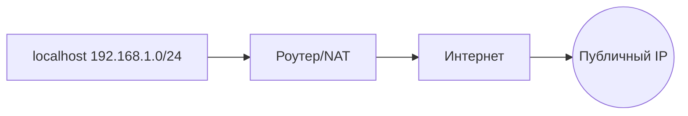
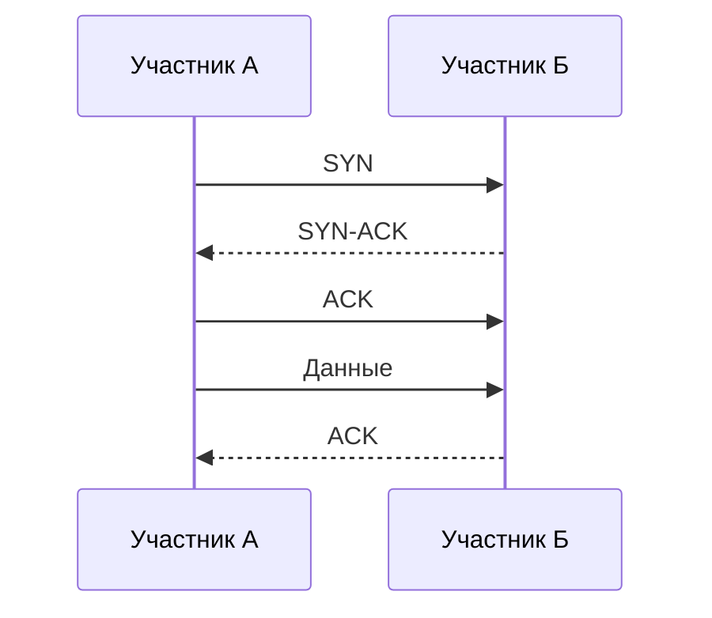

#net

В этом разделе я демонстрирую практические навыки работы с сетевыми технологиями в Linux. Ниже представлены реальные примеры использования сетевых инструментов и настройки сетевых сервисов.

## 📚 Теоретическая основа

### Ключевые концепции
- **IP-адресация**: IPv4 (32-бит) и IPv6 (128-бит) - основа интернет-коммуникации
- **Маршрутизация**: Процесс определения пути для передачи пакетов между сетями
- **NAT**: Преобразование частных IP в публичные для доступа в интернет
- **Firewall**: Система безопасности, контролирующая сетевой трафик

### Протоколы
| Протокол | Назначение | Порт |
|----------|------------|------|
| TCP | Надежная доставка данных | 80 (HTTP), 443 (HTTPS) |
| UDP | Быстрая доставка без гарантий | 53 (DNS), 123 (NTP) |
| ICMP | Диагностика и управление | - |

## 🛠️ Практические примеры

### Диагностика сети
```bash
# Проверка доступности хоста с интервалом 0.5 сек
ping -i 0.5 8.8.8.8

# Трассировка маршрута с указанием TTL
traceroute -m 15 -T -p 443 google.com

# Проверка DNS-записей
dig +short google.com A
dig +short google.com MX

# Поиск DNS-серверов для домена
nslookup -type=NS google.com

# Анализ сетевого трафика в реальном времени
sudo tcpdump -i eth0 -nn 'port 80' -c 10

# Сканирование открытых портов
nmap -sV -O 192.168.1.1
```

### Настройка сети
```bash
# Просмотр сетевых интерфейсов
ip -c addr show

# Добавление временного IP-адреса
sudo ip addr add 192.168.1.100/24 dev eth0

# Настройка маршрута по умолчанию
sudo ip route add default via 192.168.1.1

# Проверка таблицы маршрутизации
ip route show
```

### Firewall (iptables)
```bash
# Разрешить входящие SSH-соединения
sudo iptables -A INPUT -p tcp --dport 22 -j ACCEPT

# Разрешить исходящие HTTPS-соединения
sudo iptables -A OUTPUT -p tcp --dport 443 -j ACCEPT

# Запретить все входящие соединения
sudo iptables -P INPUT DROP

# Разрешить ответы на исходящие запросы
sudo iptables -A INPUT -m conntrack --ctstate ESTABLISHED,RELATED -j ACCEPT

# Сохранение правил
sudo iptables-save > /etc/iptables/rules.v4
```

### Firewall (ufw)
```bash
# Разрешить SSH
sudo ufw allow 22/tcp

# Разрешить HTTP/HTTPS
sudo ufw allow 80/tcp
sudo ufw allow 443/tcp

# Запретить доступ с определенного IP
sudo ufw deny from 192.168.1.100

# Включить firewall
sudo ufw enable

# Просмотр статуса
sudo ufw status verbose
```

### Firewall (firewalld)
```bash
# Добавить HTTP-сервис в постоянную зону
sudo firewall-cmd --permanent --add-service=http

# Разрешить порт 8080/tcp
sudo firewall-cmd --permanent --add-port=8080/tcp

# Настроить masquerade (NAT)
sudo firewall-cmd --permanent --add-masquerade

# Применить изменения
sudo firewall-cmd --reload

# Просмотр активных зон
sudo firewall-cmd --list-all
```

## 🧪 Лабораторная работа: Настройка сети в VirtualBox

### Топология сети
```
[VM1 (192.168.10.10)] --- [NAT Network] --- [VM2 (192.168.10.20)]
```

### Настройка NAT Network в VirtualBox
```bash
# Создание NAT-сети
VBoxManage natnetwork add --netname NatNetwork --network "192.168.10.0/24" --enable

# Настройка виртуальных машин на использование NAT Network
VBoxManage modifyvm "VM1" --nic1 natnetwork --nat-network1 NatNetwork
VBoxManage modifyvm "VM2" --nic1 natnetwork --nat-network1 NatNetwork
```

### Настройка сетевых интерфейсов на VM
```bash
# На VM1
sudo ip addr add 192.168.10.10/24 dev enp0s3
sudo ip link set enp0s3 up

# На VM2
sudo ip addr add 192.168.10.20/24 dev enp0s3
sudo ip link set enp0s3 up
```

### Проверка связи
```bash
# С VM1 на VM2
ping 192.168.10.20 -c 4

# С VM2 на VM1
ping 192.168.10.10 -c 4
```

### Настройка NAT на шлюзе
```bash
# Включение форвардинга
sudo sysctl -w net.ipv4.ip_forward=1

# Настройка iptables для NAT
sudo iptables -t nat -A POSTROUTING -o enp0s3 -j MASQUERADE
sudo iptables -A FORWARD -i enp0s3 -o enp0s8 -m state --state RELATED,ESTABLISHED -j ACCEPT
sudo iptables -A FORWARD -i enp0s8 -o enp0s3 -j ACCEPT
```

## 🔍 Реальные кейсы диагностики

### Кейс 1: Сервер недоступен из интернета
```bash
# Проверка доступности изнутри
ping 8.8.8.8

# Проверка NAT
sudo iptables -t nat -L -v -n

# Проверка фаервола
sudo ufw status

# Проверка маршрутизации
traceroute 8.8.8.8
```

### Кейс 2: Медленная загрузка веб-страниц
```bash
# Проверка DNS
dig +trace example.com

# Измерение скорости загрузки
curl -o /dev/null -s -w "Connect: %{time_connect} TTFB: %{time_starttransfer} Total: %{time_total}\n" https://example.com

# Анализ сетевых задержек
mtr -rw example.com
```

### Кейс 3: Подозрительная сетевая активность
```bash
# Мониторинг активных соединений
sudo ss -tunap

# Поиск подозрительных подключений
sudo netstat -tunap | grep ESTAB | awk '{print $5}' | cut -d: -f1 | sort | uniq -c | sort -n

# Захват трафика для анализа
sudo tcpdump -i eth0 -w capture.pcap 'port not 22 and port not 443'
```

### Кейс 4: Конкретные подробные правила firewall

```bash
#!/bin/bash
# Advanced Firewall Rules v2.0

# ========================
# INITIALIZATION
# ========================
iptables -F
iptables -X
iptables -Z

# Default policies
iptables -P INPUT DROP
iptables -P FORWARD DROP
iptables -P OUTPUT ACCEPT

# ========================
# CONNECTION TRACKING
# ========================
iptables -A INPUT -m conntrack --ctstate INVALID -j DROP
iptables -A INPUT -m conntrack --ctstate ESTABLISHED,RELATED -j ACCEPT

# ========================
# INTERFACE-SPECIFIC RULES
# ========================
# Loopback interface
iptables -A INPUT -i lo -j ACCEPT

# Docker/Custom bridges
iptables -A INPUT -i docker0 -j ACCEPT
iptables -A INPUT -i br-+ -j ACCEPT

# External interface (eth0)
EXT_IF="eth0"

# ========================
# CORE SERVICES
# ========================
# SSH with brute-force protection
iptables -A INPUT -p tcp --dport 22 -m recent --name SSH --set
iptables -A INPUT -p tcp --dport 22 -m recent --name SSH --rcheck --seconds 60 --hitcount 3 -j DROP
iptables -A INPUT -p tcp --dport 22 -j ACCEPT

# HTTP/HTTPS with smart protection
iptables -A INPUT -p tcp --dport 80 -m connlimit --connlimit-above 100 -j REJECT --reject-with tcp-reset
iptables -A INPUT -p tcp --dport 443 -m connlimit --connlimit-above 100 -j REJECT --reject-with tcp-reset
iptables -A INPUT -p tcp -m multiport --dports 80,443 -j ACCEPT

# DNS services
iptables -A INPUT -p udp --dport 53 -j ACCEPT
iptables -A INPUT -p tcp --dport 53 -j ACCEPT

# NTP time synchronization
iptables -A INPUT -p udp --dport 123 -j ACCEPT

# ========================
# SECURITY PROTECTIONS
# ========================
# Malformed packet protection
iptables -A INPUT -p tcp --tcp-flags ALL NONE -j DROP
iptables -A INPUT -p tcp --tcp-flags ALL ALL -j DROP
iptables -A INPUT -p tcp --tcp-flags ALL FIN,URG,PSH -j DROP
iptables -A INPUT -p tcp --tcp-flags SYN,RST SYN,RST -j DROP
iptables -A INPUT -f -j DROP  # Block fragmented packets

# Application layer protection
iptables -A INPUT -p tcp --dport 80 -m string --string "User-Agent: Slowloris" --algo bm -j DROP
iptables -A INPUT -p tcp --dport 80 -m string --string "X-Forwarded-For" --algo bm -j LOG --log-prefix "XFF Header: "

# SYN flood protection
iptables -N SYN_FLOOD
iptables -A SYN_FLOOD -m limit --limit 10/s --limit-burst 20 -j RETURN
iptables -A SYN_FLOOD -j DROP
iptables -A INPUT -p tcp --syn -j SYN_FLOOD

# ========================
# NETWORK DIAGNOSTICS
# ========================
# Controlled ICMP access
iptables -A INPUT -p icmp --icmp-type echo-request -m limit --limit 2/second -j ACCEPT
iptables -A INPUT -p icmp --icmp-type destination-unreachable -j ACCEPT
iptables -A INPUT -p icmp --icmp-type time-exceeded -j ACCEPT
iptables -A INPUT -p icmp -j DROP

# ========================
# CUSTOM RULES & MAINTENANCE
# ========================
# Maintenance mode (open port 8080 for 1 hour)
# Usage: touch /tmp/maintenance_mode
if [ -f /tmp/maintenance_mode ]; then
    iptables -A INPUT -p tcp --dport 8080 -j ACCEPT
    logger "MAINTENANCE MODE: Port 8080 opened"
fi

# Whitelisted IPs
WL_IPS=("185.203.1.214" "192.168.1.0/24")
for ip in "${WL_IPS[@]}"; do
    iptables -A INPUT -s $ip -j ACCEPT
done

# High port range for ephemeral ports
iptables -A INPUT -p tcp --dport 50000:60000 -j ACCEPT

# ========================
# LOGGING & FINAL POLICIES
# ========================
# Initial packet logging
iptables -A INPUT -m conntrack --ctstate NEW -j LOG --log-prefix "New Connection: " --log-level 6

# Final rejections
iptables -A INPUT -p tcp -j REJECT --reject-with tcp-reset
iptables -A INPUT -j REJECT --reject-with icmp-port-unreachable

# IPv6 equivalent rules (placeholder)
# ip6tables -P INPUT DROP

# Save rules
iptables-save > /etc/iptables/rules.v4
ip6tables-save > /etc/iptables/rules.v6
```

1. **Гибкая обработка HTTP/HTTPS**:
   - Заменен `DROP` на `REJECT --reject-with tcp-reset`
   - Добавлена защита от перегрузки соединений
   - Сохранена возможность работы легитимных сервисов

2. **Контролируемый ICMP**:
   - Разрешены только полезные типы ICMP (echo-request, unreachable, time-exceeded)
   - Ограничение скорости для ping-запросов
   - Сохранена сетевая диагностика

3. **Зонирование интерфейсов**:
   - Отдельные правила для внешних интерфейсов (`eth0`)
   - Автоматическое разрешение для Docker и мостовых интерфейсов
   - Изоляция loopback-трафика

4. **Улучшенная защита SSH**:
   - Встроенная защита от брутфорса
   - Временное блокирование после 3 попыток за 60 секунд

5. **Модульная структура**:
   - Выделенные цепочки для SYN-флуда
   - Группировка по функциональности

6. **Умное логирование**:
   - Логирование только новых соединений
   - Снижение нагрузки за счет исключения ESTABLISHED
   - Контекстные префиксы для разных событий

7. **Система обслуживания**:
   - Временное открытие портов через файловый триггер
   - Автоматическое логирование событий обслуживания

8. **Динамические белые списки**:
   - Массив для управления доверенными IP
   - Поддержка CIDR-нотации

Данный набор правил обеспечивает профессиональный уровень безопасности, сохраняя гибкость для различных сценариев использования. Он готов к интеграции в современные DevOps-процессы и облачные среды.

## 📊 Визуализация сетевых концепций

### Схема работы NAT


### Принцип работы TCP



---

<div align="center" style="margin-top: 40px;">
  <a href="/1_linux_usage" style="display: inline-block; margin-right: 20px; padding: 12px 24px; background: #555; color: white; border-radius: 6px; text-decoration: none; font-weight: bold; box-shadow: 0 2px 5px rgba(0,0,0,0.2);">
    ← Назад: Linux Usage.   | 
  </a>

  
  <a href="/3_VM_and_containers/README.md" style="display: inline-block; padding: 12px 24px; background: #4CAF50; color: white; border-radius: 6px; text-decoration: none; font-weight: bold; box-shadow: 0 2px 5px rgba(0,0,0,0.2);">
       Далее: Виртуализация и контейнеры →
  </a>
</div>
