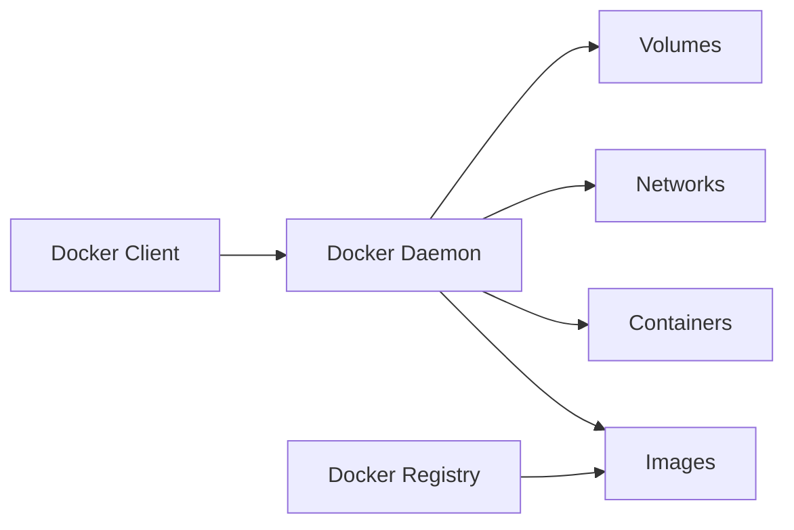

# vm_and_containers

# 🏗️ Виртуализация и контейнеризация: Практическое руководство


### Сравнительная таблица
| Характеристика          | Виртуальные машины              | Контейнеры               |
|-------------------------|--------------------------------|--------------------------|
| **Изоляция**            | Аппаратная (полная)            | Процессная               |
| **Ресурсы**             | Выделенные CPU/RAM/Диск        | Разделяемые ресурсы      |
| **Запуск**              | Минуты                         | Секунды                  |
| **Гостевая ОС**         | Требуется                      | Не требуется             |
| **Плотность**           | Низкая (5-10 на сервер)        | Высокая (50-100 на сервер)|
| **Использование**       | Legacy-приложения, Windows     | Микросервисы, Cloud-native|

---

## ⚙️ Работа с KVM (Kernel-based Virtual Machine)

### Установка и настройка
```bash
# Установка KVM на Ubuntu
sudo apt update
sudo apt install qemu-kvm libvirt-daemon-system libvirt-clients bridge-utils virt-manager

# Добавление пользователя в группы
sudo usermod -aG libvirt $USER
sudo usermod -aG kvm $USER

# Проверка установки
virsh list --all
```

### Создание виртуальной машины
```bash
# Создание образа диска (20GB)
qemu-img create -f qcow2 ubuntu-server.qcow2 20G

# Установка ОС с ISO
virt-install \
  --name ubuntu-server \
  --ram 2048 \
  --disk path=ubuntu-server.qcow2,size=20 \
  --vcpus 2 \
  --os-type linux \
  --os-variant ubuntu22.04 \
  --network bridge=virbr0 \
  --graphics none \
  --console pty,target_type=serial \
  --location 'http://archive.ubuntu.com/ubuntu/dists/jammy/main/installer-amd64/' \
  --extra-args 'console=ttyS0,115200n8 serial'
```

### Управление ВМ
```bash
# Запуск ВМ
virsh start ubuntu-server

# Остановка ВМ
virsh shutdown ubuntu-server

# Просмотр списка ВМ
virsh list --all

# Консольное подключение
virsh console ubuntu-server
```

---

## 🐳 Docker: Основные концепции

### Архитектура Docker


### Работа с образами
```bash
# Поиск образов
docker search nginx

# Скачивание образа
docker pull nginx:alpine

# Просмотр образов
docker images

# Сборка образа
docker build -t myapp:1.0 .

# Удаление образа
docker rmi nginx:alpine
```

### Управление контейнерами
```bash
# Запуск контейнера
docker run -d --name web -p 80:80 nginx:alpine

# Просмотр запущенных контейнеров
docker ps

# Просмотр логов
docker logs web

# Остановка контейнера
docker stop web

# Удаление контейнера
docker rm web

# Интерактивный режим
docker run -it ubuntu /bin/bash
```

### Volumes: Сохранение данных
```bash
# Создание volume
docker volume create db_data

# Использование volume
docker run -d --name db -v db_data:/var/lib/postgresql postgres:15

# Просмотр volumes
docker volume ls

# Резервное копирование volume
docker run --rm -v db_data:/source -v $(pwd):/backup ubuntu tar cvf /backup/db_backup.tar /source
```

### Docker Networks
```bash
# Создание сети
docker network create app_net

# Запуск контейнеров в сети
docker run -d --name frontend --network app_net nginx
docker run -d --name backend --network app_net myapp:1.0

# Проверка связи
docker exec frontend ping backend
```

---

## 🚀 Docker Compose: Оркестрация контейнеров

### Пример docker-compose.yml для веб-приложения
```yaml
version: '3.8'

services:
  web:
    image: nginx:alpine
    ports:
      - "80:80"
    volumes:
      - ./html:/usr/share/nginx/html
    networks:
      - app-net

  app:
    image: myapp:1.0
    environment:
      - DB_HOST=db
      - DB_PORT=5432
    networks:
      - app-net
    depends_on:
      - db

  db:
    image: postgres:15
    volumes:
      - db-data:/var/lib/postgresql/data
    environment:
      POSTGRES_PASSWORD: example
    networks:
      - app-net

volumes:
  db-data:

networks:
  app-net:
    driver: bridge
```

### Управление стеками
```bash
# Запуск стека
docker-compose up -d

# Просмотр запущенных сервисов
docker-compose ps

# Просмотр логов
docker-compose logs -f

# Остановка стека
docker-compose down

# Остановка с удалением volumes
docker-compose down -v
```

---

## 🔬 Лабораторная работа: Развертывание микросервисной архитектуры

### Задача: Развернуть WordPress с базой данных и кэшированием

```yaml
version: '3.8'

services:
  wordpress:
    image: wordpress:php8.2-apache
    ports:
      - 8080:80
    environment:
      WORDPRESS_DB_HOST: db
      WORDPRESS_DB_USER: wpuser
      WORDPRESS_DB_PASSWORD: wppass
      WORDPRESS_DB_NAME: wpdb
    volumes:
      - wp-content:/var/www/html/wp-content
    networks:
      - wp-net
    depends_on:
      - db
      - redis

  db:
    image: mariadb:10.6
    environment:
      MYSQL_ROOT_PASSWORD: rootpass
      MYSQL_DATABASE: wpdb
      MYSQL_USER: wpuser
      MYSQL_PASSWORD: wppass
    volumes:
      - db-data:/var/lib/mysql
    networks:
      - wp-net

  redis:
    image: redis:7-alpine
    command: redis-server --save 60 1 --loglevel warning
    networks:
      - wp-net

volumes:
  db-data:
  wp-content:

networks:
  wp-net:
```

### Запуск и проверка
```bash
docker-compose up -d
curl http://localhost:8080
```

---

## 🧪 Практические задания

### Задание 1: Создание Docker-образа
1. Создайте Dockerfile для Python-приложения
2. Соберите образ с тегом `python-app:1.0`
3. Запустите контейнер с пробросом порта 5000

```Dockerfile
# Dockerfile
FROM python:3.11-slim

WORKDIR /app

COPY requirements.txt .
RUN pip install --no-cache-dir -r requirements.txt

COPY . .

CMD ["python", "app.py"]
```

### Задание 2: Настройка сети
1. Создайте сеть `backend-net`
2. Запустите контейнеры Nginx и Redis в этой сети
3. Убедитесь, что контейнеры могут взаимодействовать

### Задание 3: Миграция ВМ
1. Создайте ВМ в KVM
2. Экспортируйте ВМ в формат OVA
3. Импортируйте ВМ в VirtualBox

---

## 💡 Лучшие практики

### Для Docker:
1. **Используйте .dockerignore**
   ```text
   .git
   .env
   node_modules
   *.log
   ```

2. **Многоступенчатая сборка**
   ```Dockerfile
   # Build stage
   FROM node:18 AS build
   WORKDIR /app
   COPY package*.json ./
   RUN npm install
   COPY . .
   RUN npm run build

   # Production stage
   FROM nginx:alpine
   COPY --from=build /app/dist /usr/share/nginx/html
   ```

3. **Безопасность**
   ```Dockerfile
   # Запуск от непривилегированного пользователя
   RUN groupadd -r appuser && useradd -r -g appuser appuser
   USER appuser
   ```

### Задание 4: Реальная практика: обертка веб-приложения в контейнер и автоматизация деплоя

В данном репозитории расположены файлы проекта по выгрузке приложения и автоматической настройки необходимых сервисов через контейнеризацию, посредством запуска скрипта. Вы можете ознакомиться с файлами и их содержимым.

<div align="center" style="margin-top: 40px;">
  <a href="/2_net/README.md" style="display: inline-block; margin-right: 20px; padding: 12px 24px; background: #555; color: white; border-radius: 6px; text-decoration: none; font-weight: bold; box-shadow: 0 2px 5px rgba(0,0,0,0.2);">
    ← Назад: Сетевые основы
  </a>
  <a href="/4_services/README.md" style="display: inline-block; padding: 12px 24px; background: #4CAF50; color: white; border-radius: 6px; text-decoration: none; font-weight: bold; box-shadow: 0 2px 5px rgba(0,0,0,0.2);">
    Далее: Установка сервисов →
  </a>
</div>
