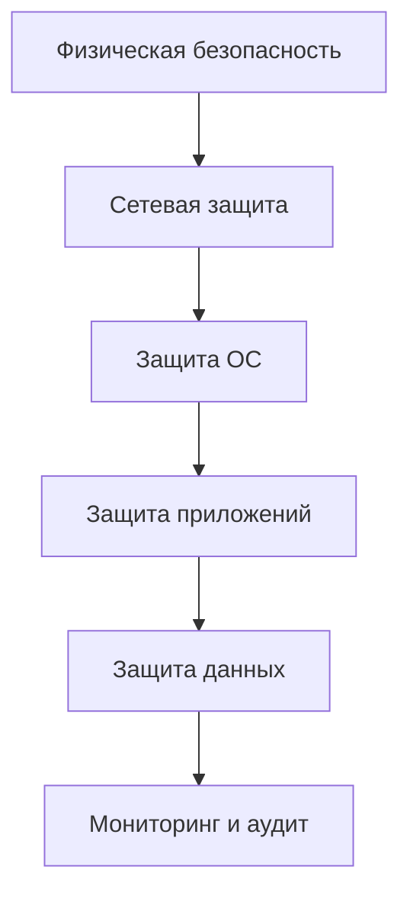

# security

# 🔐 Безопасность и Hardening сервера

## 🛡️ Комплексный подход к защите сервера

### Принципы безопасности:
1. **Минимизация поверхности атаки**
2. **Принцип наименьших привилегий**
3. **Глубинная защита**
4. **Регулярное обновление и мониторинг**



## 🔧 Базовый харденинг

### 1. Настройка пользователей и прав
```bash
# Создание пользователя с ограниченными правами
sudo adduser deploy --shell /bin/bash
sudo usermod -aG sudo deploy

# Отключение root-доступа
sudo passwd -l root
sudo usermod -s /sbin/nologin root

# Настройка sudo без пароля для определенных команд
echo "deploy ALL=(ALL) NOPASSWD: /usr/bin/apt, /usr/bin/systemctl" | sudo tee /etc/sudoers.d/deploy
```

### 2. Hardening SSH
**/etc/ssh/sshd_config:**
```bash
Port 2222
Protocol 2
PermitRootLogin no
PasswordAuthentication no
PubkeyAuthentication yes
AllowUsers deploy
LoginGraceTime 1m
MaxAuthTries 3
MaxSessions 3
ClientAliveInterval 300
ClientAliveCountMax 2
X11Forwarding no
AllowTcpForwarding no
PermitTunnel no
```

### 3. Настройка firewall
```bash
# Базовые правила UFW
sudo ufw default deny incoming
sudo ufw default allow outgoing
sudo ufw allow 2222/tcp comment 'SSH Access'
sudo ufw allow 80/tcp comment 'HTTP'
sudo ufw allow 443/tcp comment 'HTTPS'
sudo ufw enable

# Расширенные правила iptables
sudo iptables -A INPUT -p tcp --dport 2222 -m conntrack --ctstate NEW -m recent --set
sudo iptables -A INPUT -p tcp --dport 2222 -m conntrack --ctstate NEW -m recent --update --seconds 60 --hitcount 4 -j DROP
```

### 4. Отключение ненужных сервисов
```bash
sudo systemctl stop bluetooth cups avahi-daemon
sudo systemctl disable bluetooth cups avahi-daemon
```

## 🛠️ Установка инструментов безопасности

### 1. Система обнаружения вторжений (AIDE)
```bash
sudo apt install aide -y
sudo aideinit
sudo mv /var/lib/aide/aide.db.new /var/lib/aide/aide.db

# Ежедневная проверка
echo "0 5 * * * /usr/bin/aide --check" | sudo tee /etc/cron.d/aide-check
```

### 2. Сканер уязвимостей (Lynis)
```bash
sudo apt install lynis -y
sudo lynis audit system --quick

# Регулярное сканирование
echo "0 4 * * 0 root /usr/bin/lynis audit system --cronjob" | sudo tee /etc/cron.d/lynis
```

### 3. Антивирус (ClamAV)
```bash
sudo apt install clamav clamav-daemon -y
sudo freshclam
sudo systemctl start clamav-daemon

# Ежедневное сканирование
echo "0 3 * * * clamscan -r --bell -i / > /var/log/clamav/scan.log" | sudo tee /etc/cron.d/clamav-scan
```

### 4. Поиск руткитов (chkrootkit, rkhunter)
```bash
sudo apt install chkrootkit rkhunter -y

# Настройка rkhunter
sudo sed -i 's/UPDATE_MIRRORS=0/UPDATE_MIRRORS=1/' /etc/rkhunter.conf
sudo sed -i 's/MIRRORS_MODE=1/MIRRORS_MODE=0/' /etc/rkhunter.conf
sudo rkhunter --update
sudo rkhunter --propupd

# Еженедельная проверка
echo "0 4 * * 1 root /usr/bin/rkhunter --cronjob --report-warnings-only" | sudo tee /etc/cron.d/rkhunter
```

## 🧪 Аудит безопасности

### 1. Проверка уязвимостей с OpenVAS
```bash
# Установка
sudo apt install openvas -y
sudo gvm-setup

# Запуск сканирования
sudo gvm-start
sudo gvm-cli --gmp-username admin --gmp-password <password> --xml "<create_task><name>Full Scan</name><config id='daba56c8-73ec-11df-a475-002264764cea'/><target><hosts>localhost</hosts></target></create_task>"
```

### 2. Аудит с помощью Tiger
```bash
sudo apt install tiger -y
sudo tiger -e

# Анализ отчетов
sudo less /var/log/tiger/security.report.*
```

### 3. Проверка конфигурации с Bastille
```bash
sudo apt install bastille -y
sudo bastille -c

# Интерактивный харденинг
sudo bastille
```

## 🔍 Закрытие распространенных уязвимостей

### 1. Защита от MITM-атак
```bash
# Отключение слабых протоколов
sudo nano /etc/ssl/openssl.cnf
# Добавить:
openssl_conf = default_conf

[default_conf]
ssl_conf = ssl_sect

[ssl_sect]
system_default = system_default_sect

[system_default_sect]
MinProtocol = TLSv1.2
CipherString = DEFAULT@SECLEVEL=2
```

### 2. Защита от локального повышения привилегий
```bash
# Включение защит ядра
sudo nano /etc/sysctl.conf
# Добавить:
kernel.kptr_restrict=2
kernel.dmesg_restrict=1
kernel.yama.ptrace_scope=2
vm.mmap_min_addr=65536
fs.protected_hardlinks=1
fs.protected_symlinks=1
```

### 3. Защита от эксплойтов ядра
```bash
# Установка Grsecurity/PaX
sudo apt install linux-hardened -y

# Настройка AppArmor
sudo aa-enforce /etc/apparmor.d/*
```

### 4. Защита от атак на веб-приложения
```bash
# Настройка ModSecurity для Apache
sudo apt install libapache2-mod-security2 -y
sudo mv /etc/modsecurity/modsecurity.conf-recommended /etc/modsecurity/modsecurity.conf

# Конфигурация
sudo nano /etc/modsecurity/modsecurity.conf
# Изменить:
SecRuleEngine On
SecRequestBodyLimit 536870912
SecRequestBodyNoFilesLimit 131072
```

## 📊 Мониторинг и логирование

### 1. Централизованное логирование (Rsyslog)
```bash
# /etc/rsyslog.conf
module(load="imtcp")
input(type="imtcp" port="514")

*.* @logserver.example.com:514
```

### 2. Система обнаружения вторжений в реальном времени (OSSEC)
```bash
# Установка
sudo apt install ossec-hids ossec-hids-agent -y

# Настройка сервера
sudo ossec-control start
```

### 3. Анализ логов с Logwatch
```bash
sudo apt install logwatch -y
sudo nano /etc/logwatch/conf/logwatch.conf
# Установить:
Output = mail
MailTo = admin@example.com
Detail = High
```

## 🚀 Прокачка: Полный цикл харденинга

### Шаг 1: Базовый харденинг
```bash
# Запуск автоматического скрипта
curl -s https://raw.githubusercontent.com/konstruktoid/hardening/master/ubuntu.sh | sudo bash
```

### Шаг 2: Аудит безопасности
```bash
sudo lynis audit system
sudo rkhunter --check
sudo aide --check
```

### Шаг 3: Анализ результатов
```bash
# Просмотр отчетов
sudo less /var/log/lynis-report.dat
sudo less /var/log/rkhunter.log
sudo less /var/log/aide/aide.log

# Применение рекомендаций
sudo lynis show-commands
```

### Шаг 4: Постоянный мониторинг
```bash
# Настройка OSSEC для оповещений
sudo nano /var/ossec/etc/ossec.conf
# Добавить:
<global>
  <email_notification>yes</email_notification>
  <email_to>admin@example.com</email_to>
</global>
```

## 💡 Лучшие практики

1. **Регулярное обновление**
   ```bash
   sudo apt update && sudo apt upgrade -y
   sudo unattended-upgrades --enable
   ```

2. **Принцип наименьших привилегий**
   - Использовать `sudo` вместо root
   - Ограничить права приложений и пользователей
   - Используйте namespaces и cgroups

3. **Резервное копирование**
   ```bash
   # Ежедневные бэкапы
   0 2 * * * tar -zcf /backups/full-$(date +\%F).tar.gz --exclude=/backups --exclude=/proc --exclude=/tmp --exclude=/mnt --exclude=/dev --exclude=/sys /
   ```

4. **Шифрование данных**
   ```bash
   # Шифрование дисков
   sudo apt install ecryptfs-utils -y
   sudo ecryptfs-migrate-home -u deploy
   ```

---

<div align="center" style="margin-top: 40px;">
  <a href="/4_services/README.md" style="display: inline-block; margin-right: 20px; padding: 12px 24px; background: #555; color: white; border-radius: 6px; text-decoration: none; font-weight: bold; box-shadow: 0 2px 5px rgba(0,0,0,0.2);">
    ← Назад: Установка сервисов
  </a>
  <a href="/6_scripts/README.md" style="display: inline-block; padding: 12px 24px; background: #4CAF50; color: white; border-radius: 6px; text-decoration: none; font-weight: bold; box-shadow: 0 2px 5px rgba(0,0,0,0.2);">
    Далее: Скрипты и автоматизация →
  </a>
</div>
