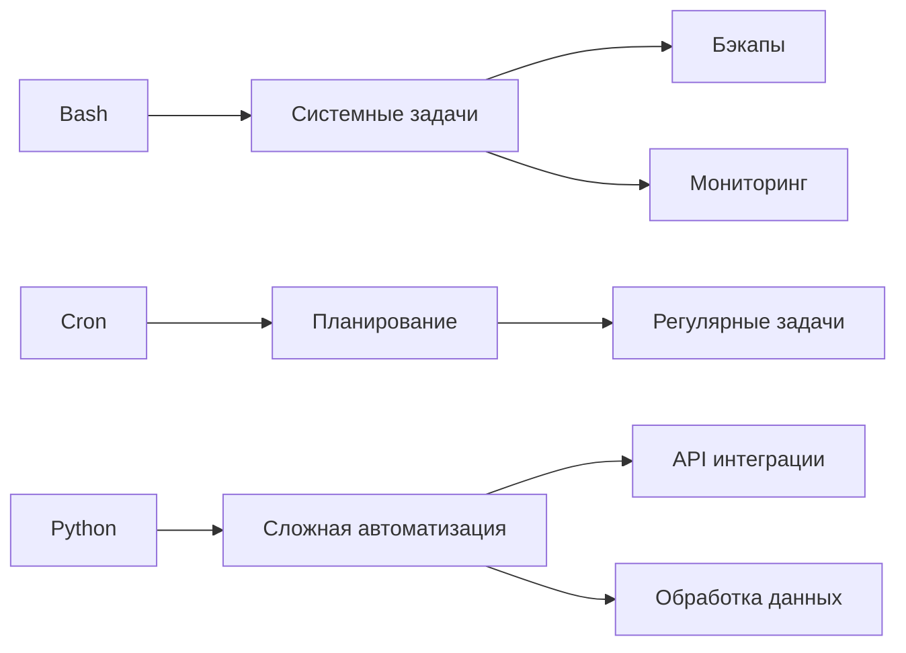

# scripts

# 🪛 Скрипты и автоматизация

## 🚀 Мощь автоматизации в DevOps



## 📜 Bash: Основы автоматизации

### 1. Скрипт для бэкапов
```bash
#!/bin/bash
# backup.sh - Полный бэкап системы с ротацией

BACKUP_DIR="/backups"
LOG_FILE="/var/log/backup.log"
RETENTION_DAYS=7
TIMESTAMP=$(date +%Y%m%d_%H%M%S)

echo "[$(date)] Начало бэкапа" >> $LOG_FILE

# Создание бэкапа
tar -czf $BACKUP_DIR/full-backup-$TIMESTAMP.tar.gz \
    --exclude=/backups \
    --exclude=/proc \
    --exclude=/tmp \
    --exclude=/mnt \
    --exclude=/dev \
    --exclude=/sys \
    --exclude=/var/log \
    /

# Проверка статуса
if [ $? -eq 0 ]; then
    echo "[$(date)] Бэкап успешно создан: full-backup-$TIMESTAMP.tar.gz" >> $LOG_FILE
    
    # Ротация бэкапов
    find $BACKUP_DIR -name "full-backup-*" -mtime +$RETENTION_DAYS -exec rm {} \;
    echo "[$(date)] Удалены старые бэкапы (> $RETENTION_DAYS дней)" >> $LOG_FILE
else
    echo "[$(date)] Ошибка создания бэкапа!" >> $LOG_FILE
    exit 1
fi

# Синхронизация с удаленным хранилищем
rsync -avz $BACKUP_DIR remote-backup-server:/backups/ >> $LOG_FILE 2>&1
```

### 2. Скрипт мониторинга ресурсов
```bash
#!/bin/bash
# monitor.sh - Мониторинг ресурсов сервера

THRESHOLD_CPU=80
THRESHOLD_MEM=85
THRESHOLD_DISK=90

# Получение метрик
CPU=$(top -bn1 | grep "Cpu(s)" | sed "s/.*, *\([0-9.]*\)%* id.*/\1/" | awk '{print 100 - $1}')
MEM=$(free | grep Mem | awk '{print $3/$2 * 100.0}')
DISK=$(df / | awk 'END{print $5}' | sed 's/%//')

# Проверка порогов
ALERT=""
if (( $(echo "$CPU > $THRESHOLD_CPU" | bc -l) )); then
    ALERT="CPU: ${CPU}% > ${THRESHOLD_CPU}%"
fi

if (( $(echo "$MEM > $THRESHOLD_MEM" | bc -l) )); then
    ALERT="$ALERT\nMEM: ${MEM}% > ${THRESHOLD_MEM}%"
fi

if (( $(echo "$DISK > $THRESHOLD_DISK" | bc -l) )); then
    ALERT="$ALERT\nDISK: ${DISK}% > ${THRESHOLD_DISK}%"
fi

# Отправка алерта
if [ -n "$ALERT" ]; then
    echo -e "Сервер: $(hostname)\n$ALERT" | mail -s "ALERT: Превышение порогов на $(hostname)" admin@example.com
fi
```

### 3. Скрипт автообновлений
```bash
#!/bin/bash
# auto-update.sh - Безопасное обновление системы

LOG_FILE="/var/log/auto-update.log"
SECURITY_ONLY=true

echo "[$(date)] Начало обновления системы" >> $LOG_FILE

if $SECURITY_ONLY; then
    # Обновление только security-пакетов
    apt-get update >> $LOG_FILE 2>&1
    apt-get upgrade --only-upgrade $(apt-get upgrade -s | grep security | awk '{print $2}') -y >> $LOG_FILE 2>&1
else
    # Полное обновление
    apt-get update >> $LOG_FILE 2>&1
    DEBIAN_FRONTEND=noninteractive apt-get upgrade -y >> $LOG_FILE 2>&1
fi

# Проверка необходимости перезагрузки
if [ -f /var/run/reboot-required ]; then
    echo "[$(date)] Требуется перезагрузка" >> $LOG_FILE
    echo "Система требует перезагрузки" | mail -s "Требуется перезагрузка $(hostname)" admin@example.com
fi

echo "[$(date)] Обновление завершено" >> $LOG_FILE
```

## ⏰ Cron: Планирование задач

### Основные команды
```bash
crontab -l          # Просмотр задач
crontab -e          # Редактирование задач
systemctl status cron # Статус службы
```

### Примеры cron-задач
```cron
# Каждый день в 2:00 - полный бэкап
0 2 * * * /usr/local/bin/backup.sh

# Каждые 5 минут - мониторинг ресурсов
*/5 * * * * /usr/local/bin/monitor.sh

# По понедельникам в 3:00 - обновление системы
0 3 * * 1 /usr/local/bin/auto-update.sh

# Каждый час - синхронизация времени
0 * * * * /usr/sbin/ntpdate pool.ntp.org > /dev/null 2>&1

# Ежедневно в 4:00 - очистка временных файлов
0 4 * * * find /tmp -type f -mtime +7 -delete
```

### Расширенное планирование
```cron
# Только в рабочие дни (пн-пт)
0 9 * * 1-5 /path/to/daily-report.sh

# В 00:00 1-го числа каждого месяца
0 0 1 * * /path/to/monthly-backup.sh

# Каждые 30 минут с 9:00 до 18:00 в рабочие дни
*/30 9-18 * * 1-5 /path/to/check-services.sh
```

## 🐍 Python для автоматизации

### 1. Мониторинг веб-сайтов
```python
# website-monitor.py
import requests
import smtplib
from datetime import datetime

SITES = [
    {"url": "https://example.com", "name": "Main Site"},
    {"url": "https://api.example.com", "name": "API Service"},
    {"url": "https://status.example.com", "name": "Status Page"},
]

def check_site(site):
    try:
        start = datetime.now()
        response = requests.get(site["url"], timeout=10)
        latency = (datetime.now() - start).total_seconds() * 1000
        
        if response.status_code == 200:
            print(f"{site['name']} - OK ({latency:.2f}ms)")
            return True
        else:
            print(f"{site['name']} - ERROR: Status {response.status_code}")
            return False
    except Exception as e:
        print(f"{site['name']} - EXCEPTION: {str(e)}")
        return False

def send_alert(site, error):
    message = f"Subject: ALERT: {site['name']} down\n\n"
    message += f"Сайт {site['name']} ({site['url']}) недоступен!\n"
    message += f"Ошибка: {error}\n\n"
    message += f"Время: {datetime.now().strftime('%Y-%m-%d %H:%M:%S')}"
    
    with smtplib.SMTP("smtp.example.com", 587) as server:
        server.login("alert@example.com", "password")
        server.sendmail("alert@example.com", "admin@example.com", message)

if __name__ == "__main__":
    for site in SITES:
        if not check_site(site):
            send_alert(site, "Проверка не удалась")
```

### 2. Автоматизация управления Docker
```python
# docker-manager.py
import docker
import logging
import sys

logging.basicConfig(level=logging.INFO, format='%(asctime)s - %(levelname)s - %(message)s')

def main(action, container_name):
    client = docker.from_env()
    
    try:
        if action == "start":
            container = client.containers.get(container_name)
            if container.status != "running":
                container.start()
                logging.info(f"Контейнер {container_name} запущен")
            else:
                logging.info(f"Контейнер {container_name} уже запущен")
                
        elif action == "stop":
            container = client.containers.get(container_name)
            if container.status == "running":
                container.stop()
                logging.info(f"Контейнер {container_name} остановлен")
            else:
                logging.info(f"Контейнер {container_name} уже остановлен")
                
        elif action == "restart":
            container = client.containers.get(container_name)
            container.restart()
            logging.info(f"Контейнер {container_name} перезапущен")
            
        elif action == "update":
            container = client.containers.get(container_name)
            image_name = container.image.tags[0]
            
            logging.info(f"Обновление образа {image_name}")
            client.images.pull(image_name)
            
            container.stop()
            container.remove()
            
            new_container = client.containers.run(
                image_name,
                name=container_name,
                detach=True,
                restart_policy={"Name": "always"},
                volumes={v.name: {'bind': v['Destination'], 'mode': v['Mode']} 
                         for v in container.attrs['Mounts']},
                ports={k: v[0]['HostPort'] for k, v in 
                       container.attrs['NetworkSettings']['Ports'].items() if v}
            )
            logging.info(f"Контейнер {container_name} обновлен")
            
        else:
            logging.error(f"Неизвестное действие: {action}")
            sys.exit(1)
            
    except docker.errors.NotFound:
        logging.error(f"Контейнер {container_name} не найден")
        sys.exit(1)
    except docker.errors.APIError as e:
        logging.error(f"Ошибка Docker API: {str(e)}")
        sys.exit(1)

if __name__ == "__main__":
    if len(sys.argv) != 3:
        print("Использование: python docker-manager.py <start|stop|restart|update> <container_name>")
        sys.exit(1)
        
    action = sys.argv[1]
    container_name = sys.argv[2]
    main(action, container_name)
```

### 3. Интеграция с API облачных провайдеров
```python
# cloud-backup.py
import boto3
import datetime
import os
import subprocess

AWS_ACCESS_KEY = "YOUR_ACCESS_KEY"
AWS_SECRET_KEY = "YOUR_SECRET_KEY"
S3_BUCKET = "your-backup-bucket"
BACKUP_DIR = "/backups"
RETENTION_DAYS = 7

def create_backup():
    timestamp = datetime.datetime.now().strftime("%Y%m%d_%H%M%S")
    backup_file = f"{BACKUP_DIR}/full-backup-{timestamp}.tar.gz"
    
    # Создание бэкапа
    subprocess.run([
        "tar", "czf", backup_file,
        "--exclude=/backups",
        "--exclude=/proc",
        "--exclude=/tmp",
        "--exclude=/mnt",
        "--exclude=/dev",
        "--exclude=/sys",
        "/"
    ], check=True)
    
    return backup_file

def upload_to_s3(file_path):
    s3 = boto3.client(
        's3',
        aws_access_key_id=AWS_ACCESS_KEY,
        aws_secret_access_key=AWS_SECRET_KEY
    )
    
    file_name = os.path.basename(file_path)
    s3.upload_file(file_path, S3_BUCKET, file_name)
    print(f"Файл {file_name} загружен в S3")

def cleanup_local():
    cutoff = datetime.datetime.now() - datetime.timedelta(days=RETENTION_DAYS)
    
    for file in os.listdir(BACKUP_DIR):
        file_path = os.path.join(BACKUP_DIR, file)
        file_time = datetime.datetime.fromtimestamp(os.path.getmtime(file_path))
        
        if file_time < cutoff:
            os.remove(file_path)
            print(f"Удален старый файл: {file}")

if __name__ == "__main__":
    try:
        # Создание и загрузка бэкапа
        backup_file = create_backup()
        upload_to_s3(backup_file)
        
        # Очистка локальных файлов
        cleanup_local()
        
        print("Процесс бэкапа завершен успешно")
    except Exception as e:
        print(f"Ошибка при выполнении бэкапа: {str(e)}")
```

## 🧪 Практические задания

### Задание 1: Создание системы мониторинга
1. Напишите bash-скрипт, который проверяет:
   - Доступность портов 80, 443, 22
   - Свободное место на диске
   - Загрузку CPU и RAM
2. Настройте cron для запуска каждые 5 минут
3. При превышении порогов отправляйте email

### Задание 2: Автоматизация бэкапов баз данных
1. Создайте Python-скрипт для:
   - Дампов MySQL/PostgreSQL баз
   - Шифрования бэкапов
   - Загрузки в облачное хранилище
2. Реализуйте ротацию бэкапов
3. Настройте ежедневное выполнение через cron

### Задание 3: Self-healing система
1. Разработайте Python-скрипт, который:
   - Обнаруживает упавшие сервисы (по процессам или портам)
   - Автоматически перезапускает их
   - Отправляет уведомление о проблеме
2. Протестируйте на Docker-контейнерах
3. Настройте мониторинг работы скрипта

## 💡 Лучшие практики автоматизации

### Для Bash:
1. **Обработка ошибок**
   ```bash
   set -euo pipefail
   trap "echo 'Скрипт прерван!'; exit 1" SIGINT SIGTERM
   ```

2. **Логирование**
   ```bash
   exec > >(tee -a "$LOG_FILE") 2>&1
   ```

3. **Параметризация**
   ```bash
   # Используйте переменные
   BACKUP_DIR="/backups"
   RETENTION_DAYS=7
   ```

### Для Cron:
1. **Указание полных путей**
   ```cron
   # Плохо:
   * * * * * script.sh
   
   # Хорошо:
   * * * * * /full/path/to/script.sh
   ```

2. **Логирование**
   ```cron
   # Логировать вывод в файл
   * * * * * /path/to/script.sh >> /var/log/script.log 2>&1
   ```

3. **Переменные окружения**
   ```cron
   # Установка окружения
   PATH=/usr/local/sbin:/usr/local/bin:/sbin:/bin:/usr/sbin:/usr/bin
   SHELL=/bin/bash
   
   * * * * * /path/to/script.sh
   ```

### Для Python:
1. **Виртуальные окружения**
   ```bash
   python -m venv venv
   source venv/bin/activate
   pip install -r requirements.txt
   ```

2. **Логирование**
   ```python
   import logging
   logging.basicConfig(
       level=logging.INFO,
       format='%(asctime)s - %(name)s - %(levelname)s - %(message)s',
       handlers=[logging.FileHandler("app.log"), logging.StreamHandler()]
   )
   ```

3. **Обработка ошибок**
   ```python
   try:
       # Код с риском ошибок
   except SpecificException as e:
       # Обработка конкретной ошибки
   except Exception as e:
       # Общая обработка
       logging.error(f"Необработанная ошибка: {str(e)}", exc_info=True)
   ```


---

<div align="center" style="margin-top: 40px;">
  <a href="/🔐_5_Security_Hardening/README.md" style="display: inline-block; margin-right: 20px; padding: 12px 24px; background: #555; color: white; border-radius: 6px; text-decoration: none; font-weight: bold; box-shadow: 0 2px 5px rgba(0,0,0,0.2);">
    ← Назад: Безопасность и Hardening
  </a>
  <a href="/📈_7_Monitoring_Logging/README.md" style="display: inline-block; padding: 12px 24px; background: #4CAF50; color: white; border-radius: 6px; text-decoration: none; font-weight: bold; box-shadow: 0 2px 5px rgba(0,0,0,0.2);">
    Далее: Мониторинг и логирование →
  </a>
</div>
